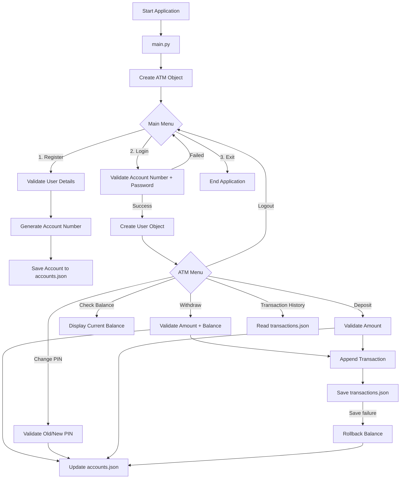

# ATM Management System in Python

A console-based ATM Management System built with Python to demonstrate object-oriented programming, user-defined modules, JSON file handling, input validation, exception handling, loops, persistent storage, and automated testing.

This project is designed as a practical portfolio project for learning how multiple Python concepts work together in a real-world style application.

## Project Objective

Build a menu-driven ATM application where users can register, log in, manage their balance, change their PIN, and review transaction history while keeping account data permanently stored in JSON files.

## Features

- User registration with validation
- Automatic account number generation starting from `100000000001`
- Login using account number and password
- Withdraw money with balance validation
- Deposit money
- Check current balance
- Change ATM PIN
- Transaction history
- JSON-based persistent account storage
- Separate `User` and `ATM` classes
- Robust exception handling for input, JSON, and file failures
- Balance rollback if transaction-history persistence fails
- Malformed-record detection with clear warnings
- Portable file paths using `pathlib`
- Windows launcher with bytecode disabled
- Automated unit tests using `unittest`

## Python Concepts Demonstrated

- Object-Oriented Programming (OOP)
- Classes and objects
- User-defined modules
- Functions and methods
- `while` loops and `for` loops
- Conditional statements
- Lists and dictionaries
- JSON file handling
- Exception handling
- Custom exceptions
- Input validation
- Static methods
- Time/date handling
- Persistent storage
- Unit testing with Python `unittest`
- Mocking with `unittest.mock`

## Project Structure

```text
atm-management-system-python/
├── main.py
├── run_atm.bat
├── README.md
├── GUIDE_ALIGNMENT.md
├── requirements.txt
├── .gitignore
├── classes/
│   ├── __init__.py
│   ├── UserConfig.py
│   └── ATMConfig.py
├── data/
│   ├── accounts.json
│   └── transactions.json
└── tests/
    ├── __init__.py
    └── test_atm.py
```

## Architecture / Project Flow



### CLI Flow

```text
=== ATM MANAGEMENT SYSTEM ===
1. Register
2. Login
3. Exit
        |
        v
   Successful Login
        |
        v
=== ATM MENU ===
1. Withdraw
2. Check Balance
3. Change PIN
4. Deposit
5. Transaction History
6. Logout
```

## Validation Rules

- Name must contain valid alphabetic characters
- Phone number must contain 10-15 digits
- Email must match a valid email format
- Password must contain uppercase, lowercase, number, and special character
- PIN must contain exactly 4 digits
- Deposit and withdrawal amounts must be positive finite numbers
- Duplicate phone numbers and email addresses are rejected
- Withdrawal is blocked when the account balance is insufficient

## Exception Handling & Recovery

The project distinguishes expected data errors from normal empty data and avoids silently hiding corrupted storage.

- Missing JSON files are treated as first-run empty storage
- Corrupted JSON raises a clear `DataStoreError` instead of being treated as an empty account list
- JSON files with the wrong top-level structure are rejected
- File read errors are reported clearly
- File write errors return a failure result and display a useful message
- JSON writes use a temporary file before replacement to reduce the risk of partial/corrupted writes
- Malformed account and transaction records are skipped with visible warnings
- Incomplete or invalid account records cannot be used for login
- Deposit and withdrawal changes are rolled back when transaction-history saving fails
- A critical warning is displayed if a rollback itself cannot be persisted
- ATM operations guard against being called without a logged-in user
- `update_user_data()` synchronizes the current user's editable fields back to JSON

These checks are intentionally focused on expected runtime failures rather than hiding programming errors with broad `except Exception` blocks.

## Data Storage

Account information is stored in:

```text
data/accounts.json
```

Transaction records are stored in:

```text
data/transactions.json
```

The project uses relative paths based on the project location, so it can be moved to another folder or drive without changing the Python source code.

## Run the Project

### Windows

```powershell
python -B main.py
```

or:

```powershell
py -B main.py
```

You can also double-click:

```text
run_atm.bat
```

The `-B` option prevents creation of `.pyc` files and `__pycache__` directories.

## Run the Unit Tests

From the repository root:

```powershell
python -B -m unittest discover -s tests -v
```

or:

```powershell
py -B -m unittest discover -s tests -v
```

The tests use temporary JSON files so the real account and transaction data in the repository are not modified.

## Test Coverage

The test suite covers the complete project checklist plus failure/recovery scenarios, including:

- Running with no accounts
- First and second account-number generation
- Restart persistence
- Correct and incorrect login credentials
- Balance checking
- Valid deposit and withdrawal
- Zero/negative deposit and withdrawal input
- Insufficient balance
- Correct, incorrect, invalid, and unchanged PIN scenarios
- Balance and PIN persistence after restart
- Deposit and withdrawal transaction records
- Input-validation helpers
- Corrupted JSON detection
- Invalid JSON structure detection
- Deposit rollback when transaction saving fails
- Withdrawal rollback when transaction saving fails
- Synchronization of editable user fields
- Safe behavior when an operation is called without login

## Example Menus

### Main Menu

```text
=== ATM MANAGEMENT SYSTEM ===
1. Register
2. Login
3. Exit
Enter choice:
```

### ATM Menu

```text
=== ATM MENU ===
1. Withdraw
2. Check Balance
3. Change PIN
4. Deposit
5. Transaction History
6. Logout
Enter choice:
```

## Security Note

> **Educational use only:** this project intentionally stores passwords and PINs in plaintext JSON files so beginners can clearly see how file handling and persistent storage work.
>
> **Do not use this approach in a real banking, financial, or production application.** Real systems should use password hashing (for example, Argon2 or bcrypt), encrypted storage where appropriate, strict access controls, protected secrets, audit logging, rate limiting, secure session handling, database security, and multi-factor authentication.
>
> Never commit real credentials, PINs, API keys, or personal banking data to this repository.

## Technologies Used

- Python 3
- Python Standard Library
- JSON
- `pathlib`
- `re`
- `time`
- `math`
- `unittest`
- `unittest.mock`

No third-party packages are required.

## Learning Outcomes

This project demonstrates how to:

- Organize Python code into multiple modules
- Apply OOP to a practical application
- Build menu-driven console programs
- Validate user input safely
- Read and write persistent JSON data
- Synchronize in-memory objects with stored records
- Handle expected runtime errors clearly
- Recover safely from transaction persistence failures
- Write isolated unit tests for application logic and failure paths

## Author

**Alok Agarwal**

GitHub: [mightyalok00](https://github.com/mightyalok00)

---

If you find this project useful, consider starring the repository.
